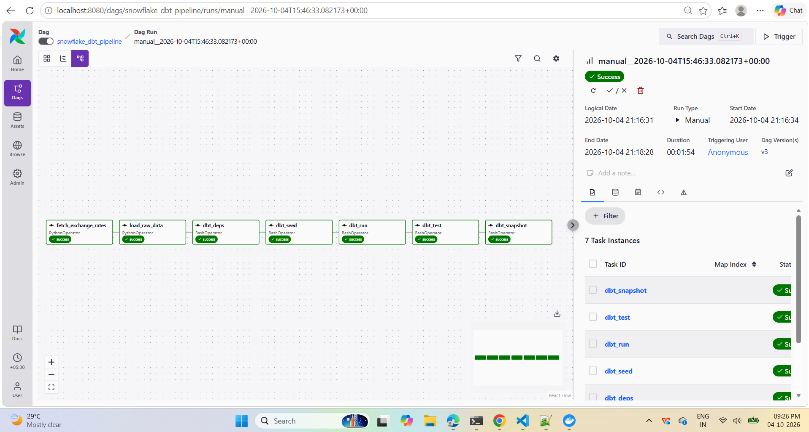
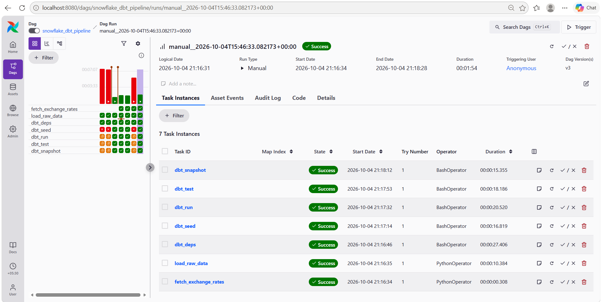

# Snowflake + dbt + Airflow ELT Pipeline

An end-to-end ELT pipeline: raw data is loaded into **Snowflake**, transformed with **dbt** (staging → intermediate → marts), validated with data tests, and orchestrated by **Apache Airflow** running in **Docker** (Astro CLI).

This extends my earlier Snowflake + dbt project: [Jahnavi-L-2001/project](https://github.com/Jahnavi-L-2001/project).

## Pipeline flow

`load_raw_data` → `dbt_deps` → `dbt_seed` → `dbt_run` → `dbt_test` → `dbt_snapshot`

| Task | What it does |
|---|---|
| `load_raw_data` | Python connects to Snowflake, uploads CSVs to an internal stage, and loads the RAW tables with `COPY INTO` |
| `dbt_deps` | Installs dbt packages (`dbt_utils`) |
| `dbt_seed` | Loads reference data (`valid_categories.csv`) |
| `dbt_run` | Builds 9 models: staging views, intermediate views, mart tables |
| `dbt_test` | Runs 28 data tests (not null, unique, relationships, accepted values, custom tests) |
| `dbt_snapshot` | Maintains an SCD Type 2 history of orders |

The DAG runs daily with 2 retries per task and `max_active_runs=1` to prevent overlapping runs.




## What is in the dbt project

- **Staging:** `stg_employee`, `stg_family`, `stg_orders` (cleaning and renaming)
- **Intermediate:** `int_employee`, `int_family`, `int_orders_incremental` (joins and an incremental model)
- **Marts:** `mart_employee_directory`, `mart_sales_by_category`, `family_masked` (with a column-masking macro)
- **Snapshot:** `orders_snapshot` (SCD Type 2)
- **Tests:** 28 tests, including custom SQL tests for positive order amounts and masked phone numbers

## Tech stack

Snowflake, dbt Core, Apache Airflow, Docker, Astro CLI, Python, SQL, Git

## Security

Snowflake no longer accepts passwords for programmatic access, so dbt and Airflow connect with **key-pair authentication**. The private key and `.env` are never committed (see `.gitignore`).

## How to run

1. Install Docker Desktop and the Astro CLI.
2. In Snowflake, run `dags/dbt_project/snowflake-setup/sql/warehouse_database_schema.sql`, then create the file formats and RAW tables:
```sql
   USE DATABASE ANALYTICS_DB;
   USE SCHEMA RAW;
   CREATE OR REPLACE FILE FORMAT csv_format TYPE = CSV SKIP_HEADER = 1 FIELD_OPTIONALLY_ENCLOSED_BY = '"';
   CREATE OR REPLACE TABLE employee (empno INT, ename STRING, job STRING, mgr INT, hiredate DATE, sal FLOAT, comm FLOAT, deptno INT);
   CREATE OR REPLACE TABLE family (parent_name STRING, gender STRING, dob DATE, city STRING, state STRING, house_number STRING, office_phone STRING, personal_phone STRING, kid_name STRING);
   CREATE OR REPLACE TABLE orders (order_id INT, customer_name STRING, order_date DATE, category STRING, amount FLOAT);
```
3. Generate an RSA key pair, attach the public key to your Snowflake user (`ALTER USER ... SET RSA_PUBLIC_KEY=...`), and save the private key as `include/keys/rsa_key.p8`.
4. Create a `.env` file in the project root:
```
   SNOWFLAKE_ACCOUNT=<orgname-accountname>
   SNOWFLAKE_USER=<your_user>
```
5. Start Airflow and open http://localhost:8080:
```
   astro dev start
```
6. Trigger the DAG `snowflake_dbt_pipeline`.

## Notes

- The data in `include/data/` is **sample data** created for demonstration.
- The earlier version of this project loaded data from AWS S3 using a storage integration and Snowpipe. Those scripts are kept in `dags/dbt_project/snowflake-setup/sql/`, but this version loads through an internal Snowflake stage so it runs without an AWS account.
- `snowflake-setup/snowpark/connect.py` comes from the earlier version and uses password authentication, which Snowflake no longer supports.